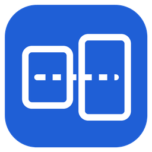
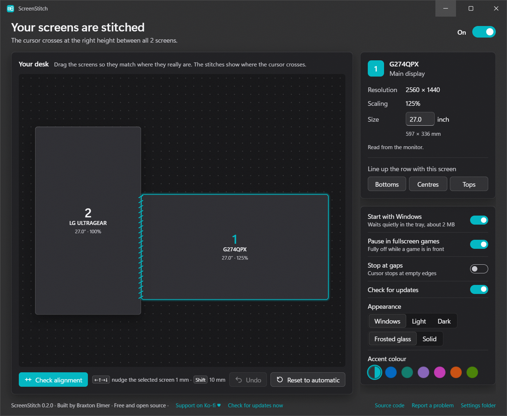

<div align="center">



# ScreenStitch

**Stops the cursor jumping when it moves between monitors of different sizes.**

[](https://github.com/BraxtonElmer/ScreenStitch/releases/latest)
[](https://github.com/BraxtonElmer/ScreenStitch/releases)

[](LICENSE)

[](https://ko-fi.com/akariyu)



</div>

## The problem

Put a 1440p monitor next to a 4K one, or turn one on its side, and the cursor
jumps up or down every time it crosses between them. Windows joins screens
pixel by pixel, so pixel 700 on one lines up with pixel 700 on the other even
though they sit at different heights on your desk.

ScreenStitch joins them by their real, physical size instead, so the cursor
comes out exactly where your hand expects it.

## What it does

- **Works out of the box.** It reads each monitor's real size from the monitor
  itself and guesses how they're arranged from your Windows display settings.
- **Drag your screens to match your desk.** Changes apply instantly, and
  *Check alignment* draws one straight line across all your real screens so you
  can see at a glance if anything is off. Arrow keys nudge a screen 1 mm.
- **Stays out of your games.** It only does anything at the moment the cursor
  leaves a screen. Mouse speed, DPI and acceleration are never touched, and it
  removes itself completely while a fullscreen game is open.
- **Your choice at gaps.** Where part of an edge has no screen beside it, the
  cursor either hops to the nearest point of the next screen or stops there,
  like the real gap on your desk.
- **Small.** The part that runs in the tray is under 500 KB and uses about 2 MB
  of memory. The settings window closes completely when you close it.
- **Keeps itself up to date**, and asks before installing anything. No telemetry.

Hold **Ctrl** to cross the plain Windows way, or press **Ctrl+Alt+Shift+S** to
turn ScreenStitch on or off.

## Install

Grab the installer from the
[latest release](https://github.com/BraxtonElmer/ScreenStitch/releases/latest)
and run it. No admin rights needed. If you'd rather not install anything,
there's a portable zip too.

The app isn't code-signed yet, so Windows shows an "unknown publisher" warning
the first time. Click **More info → Run anyway**.

## Build it yourself

You need Rust and Node.js.

```powershell
./scripts/build.ps1              # ready-to-run copy in dist/
./scripts/build.ps1 -Installer   # also builds the installer
```

| Folder | What's in it |
| --- | --- |
| `crates/core` | Geometry, desk layout and the crossing logic. No Windows code, fully tested. |
| `crates/platform` | Monitor detection, EDID, settings file, start with Windows. |
| `crates/tray` | `ScreenStitch.exe`: the tray app and the mouse hook. |
| `settings` | The settings window (Tauri + Svelte). |

## Support

ScreenStitch is free and always will be. If it saved you some frustration and
you'd like to say thanks, you can [buy me a coffee on Ko-fi](https://ko-fi.com/akariyu).

Found a bug or have an idea? [Open an issue](https://github.com/BraxtonElmer/ScreenStitch/issues).

## License

[GPL-3.0](LICENSE). Built by Braxton Elmer.
